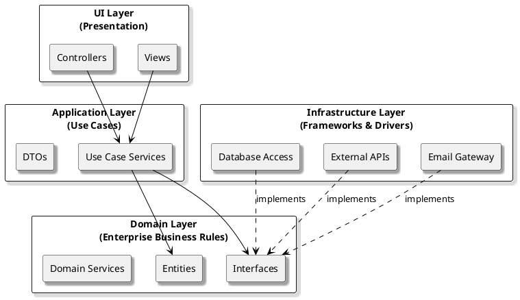

# Layered Architecture

## What Is Layered Architecture?

**Layered Architecture** (also known as **N-Tier Architecture**) is one of the most widely used architectural patterns in software development. It organizes an application into horizontal layers, each with a distinct responsibility. In the context of **Clean Architecture**, the layered approach helps you separate concerns, enforce boundaries, and keep your business logic insulated from technical details.

### Typical Layers

- **Presentation Layer:** Handles user interface and user interaction.
- **Application Layer:** Coordinates application activity and orchestrates use cases.
- **Domain Layer:** Contains business rules and core logic (the heart of your system).
- **Infrastructure Layer:** Manages technical details like databases, file systems, and external services.

Each layer communicates only with the layer directly beneath it, creating a clear and maintainable structure.

---

## Strengths and Weaknesses

| Strengths                                   | Weaknesses                                      |
|----------------------------------------------|-------------------------------------------------|
| Simple, well-understood structure            | Can lead to rigid, hard-to-change dependencies   |
| Clear separation of concerns                 | Risk of “leaky” abstractions between layers     |
| Supports independent development and testing | May encourage “anemic” domain models            |
| Easy to onboard new team members             | Changes in lower layers can ripple upward       |
| Works well for traditional business systems  | Not ideal for highly dynamic or cross-cutting concerns |

---

## When to Use Layered Architecture

**Layered Architecture** is a good fit when:

- Your application has clear, distinct responsibilities (UI, business logic, data access).
- You want to enforce boundaries between technical concerns.
- Your team is familiar with traditional enterprise patterns.
- You need a structure that supports independent development and testing of layers.

**Examples:**

- Enterprise web applications (e.g., ASP.NET MVC, Java Spring)
- Internal business systems with well-defined workflows
- Applications where business rules are stable and infrastructure changes infrequently

---

## Practical Tips

- **Keep business logic in the domain layer:** Don’t let UI or infrastructure concerns leak into your core logic.
- **Use interfaces to abstract dependencies:** This allows you to swap out implementations without changing higher layers.
- **Test each layer in isolation:** Mock dependencies to ensure your tests are focused and reliable.
- **Avoid over-complicating:** Don’t add unnecessary layers—keep your architecture as simple as your requirements allow.

---

## Takeaway

Layered Architecture provides a clear, time-tested way to organize your codebase.  
It’s easy to understand and works well for many business applications, but be mindful of its limitations as your system grows in complexity or requires more flexibility.

<!-- | Architecture characteristic | Star rating        |
|----------------------------|--------------------|
| Partitioning type          | Technical          |
| Number of quanta           | 1                  |
| Deployability              | ⭐                 |
| Elasticity                 | ⭐                 |
| Evolutionary               | ⭐                 |
| Fault tolerance            | ⭐                 |
| Modularity                 | ⭐                 |
| Overall cost               | ⭐⭐⭐⭐⭐             |
| Performance                | ⭐⭐                |
| Reliability                | ⭐⭐⭐              |
| Scalability                | ⭐                 |
| Simplicity                 | ⭐⭐⭐⭐             |
| Testability                | ⭐                 | -->
