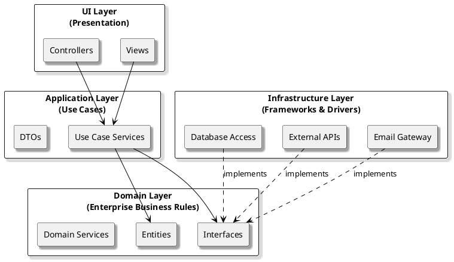

# Layered Architecture

## Overview

The *Layered Architecture* (also known as N-Tier Architecture) is a classic architectural style that structures an application into a series of horizontal layers. Each layer has a specific role and responsibility, and communicates only with the layers directly above or below it. This approach enforces clear boundaries between technical concerns, making systems easier to understand, develop, and maintain.

### Typical Layers

- **Presentation Layer:** Handles user interface and user interaction logic.
- **Application Layer:** Coordinates application activity and workflow (sometimes merged with business logic).
- **Domain (Business Logic) Layer:** Encapsulates core business rules and domain logic.
- **Infrastructure/Data Access Layer:** Manages data persistence, external services, and infrastructure concerns.

---

## Strengths and Weaknesses

| Strengths                                        | Weaknesses                                         |
|--------------------------------------------------|----------------------------------------------------|
| Clear separation of concerns                     | Can become rigid and hard to adapt to change       |
| Easy to understand and communicate               | Risk of "leaky" abstractions between layers        |
| Supports independent development and testing     | May encourage anemic domain models                 |
| Facilitates code reuse within layers             | Tendency toward over-engineering with too many layers |
| Well-supported by frameworks and tooling         | Not ideal for highly complex or rapidly evolving domains |

---

## When to Use Layered Architecture

**Layered Architecture** is a good fit when:

- Your application has clear, distinct responsibilities (UI, business logic, data access).
- You want to enforce boundaries between technical concerns.
- Your team is familiar with traditional enterprise patterns.
- You need a structure that supports independent development and testing of layers.

**Examples:**

- Enterprise web applications (e.g., ASP.NET MVC, Java Spring)
- Internal business systems with well-defined workflows
- Applications where business rules are stable and infrastructure changes infrequently

---

## Practical Tips

- **Keep business logic in the domain layer:** Don’t let UI or infrastructure concerns leak into your core logic.
- **Use interfaces to abstract dependencies:** This allows you to swap out implementations without changing higher layers.
- **Test each layer in isolation:** Mock dependencies to ensure your tests are focused and reliable.
- **Avoid over-complicating:** Don’t add unnecessary layers—keep your architecture as simple as your requirements allow.

---

## Takeaway

Layered Architecture provides a clear, time-tested way to organize your codebase.  
It’s easy to understand and works well for many business applications, but be mindful of its limitations as your system grows in complexity or requires more flexibility.
