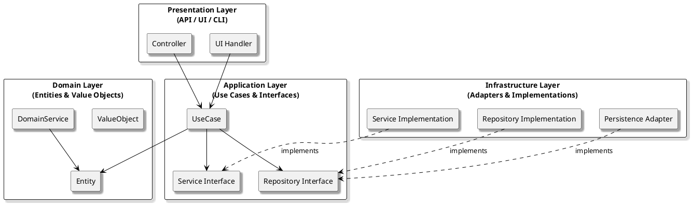

# Onion Architecture

## Overview

*Onion Architecture* is an architectural style that structures an application as a series of concentric circles (layers), with the core domain model at the center. Each outer layer depends only on the next inner layer, never the other way around. This design enforces a strict separation between business logic and external concerns, ensuring that the core remains independent, testable, and adaptable.

### Typical Layers

- **Domain Model (Core):** Contains business entities and domain logic. No dependencies on any other layer.
- **Domain Services/Application Services:** Implements business use cases and orchestrates domain objects. Depends only on the domain model.
- **Interfaces (Ports):** Defines contracts for external operations (repositories, services, etc.) required by the core.
- **Infrastructure (Adapters):** Provides implementations for interfaces (e.g., database, external APIs, frameworks). Depends on interfaces, not the core.

---

## Strengths and Weaknesses

| Strengths                                         | Weaknesses                                        |
|---------------------------------------------------|---------------------------------------------------|
| Strict separation of concerns                     | Can be overkill for simple or CRUD-heavy systems  |
| Core business logic is isolated and protected     | May require more upfront design and abstraction   |
| Highly testable and maintainable                  | More interfaces and indirection to manage         |
| Flexible adaptation to infrastructure changes     | Can be harder for teams unfamiliar with DDD       |
| Supports long-term evolution and refactoring      | Potential for boilerplate code                    |

---

## When to Use Onion Architecture

**Onion Architecture** is a good fit when:

- Business logic is complex, central, and expected to evolve.
- You need to protect core logic from infrastructure and framework changes.
- Testability and long-term maintainability are high priorities.
- Your team is comfortable with domain-driven design concepts.

**Examples:**

- Enterprise systems with rich business rules
- Applications requiring strong isolation from databases, frameworks, or UI
- Systems where core logic must be reused across multiple interfaces (e.g., web, mobile, services)

---

## Practical Tips

- **Keep the domain model pure:** Avoid dependencies on frameworks, databases, or UI in the core.
- **Define interfaces in the inner layers:** Let outer layers provide implementations, injected via dependency inversion.
- **Test the core in isolation:** Use mocks or stubs for infrastructure dependencies.
- **Resist shortcutting the architecture:** Don’t let infrastructure concerns leak inward.
- **Document boundaries and dependencies:** Make the direction of dependencies explicit for your team.

---

## Takeaway

Onion Architecture enforces a strong separation between business logic and external concerns, keeping your core model pure and adaptable.  
It is ideal for complex, long-lived systems where business rules must remain insulated from infrastructure changes, but may introduce additional complexity for simple applications.
