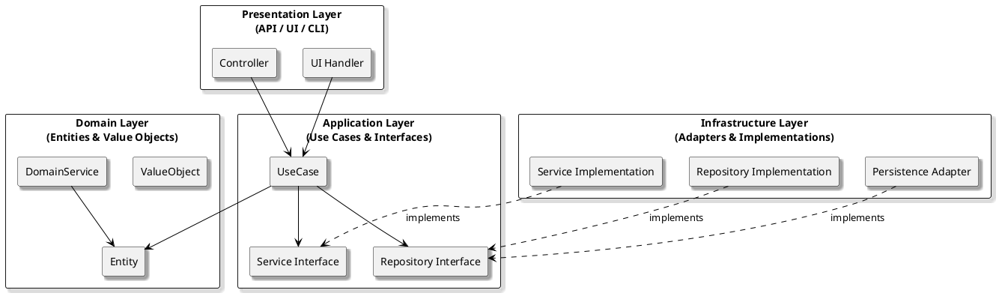

# Onion Architecture

## What Is Onion Architecture?

**Onion Architecture** is a layered architectural pattern that places the **domain model** at the core of your application. All dependencies point inward, ensuring that business logic remains isolated from external concerns like databases, frameworks, and user interfaces. This approach aligns closely with the goals of **Clean Architecture**—keeping your core logic independent, testable, and adaptable.

### Key Characteristics

- **Domain-centric:** The domain model (business rules) is at the center.
- **Concentric layers:** Each layer wraps around the core, with clear boundaries.
- **Dependency inversion:** Outer layers depend on inner layers, never the reverse.
- **Interfaces for boundaries:** Communication between layers happens through interfaces or contracts.
- **Infrastructure as outermost:** Databases, frameworks, and external systems are at the edge.

---

## Strengths and Weaknesses

| Strengths                                         | Weaknesses                                      |
|---------------------------------------------------|-------------------------------------------------|
| Strong separation of concerns                     | Can introduce complexity for small projects      |
| Business logic is insulated from infrastructure   | May require more upfront design and abstraction  |
| Highly testable and maintainable core             | Not always a natural fit for CRUD-only systems   |
| Easy to swap out infrastructure or UI             | Can be overkill for simple applications         |
| Supports long-term adaptability and refactoring   | Requires discipline to enforce boundaries        |

---

## When to Use Onion Architecture

**Onion Architecture** is a strong choice when:

- Your application has complex or evolving business rules.
- You want to maximize testability and maintainability.
- You need to support multiple UIs or data sources (e.g., web, mobile, APIs).
- You expect to swap out infrastructure or frameworks over time.
- You are practicing domain-driven design (DDD).

**Examples:**

- Enterprise systems with rich business logic and multiple integration points.
- Applications that must support both web and mobile interfaces.
- Systems where business rules must remain stable even as technology changes.
- Projects where automated testing and long-term maintainability are top priorities.

---

## Practical Tips

- **Start with the domain model:** Define your core business entities and rules first.
- **Use interfaces for boundaries:** Let outer layers (like repositories or services) depend on abstractions defined in the core.
- **Keep infrastructure at the edge:** Implement data access, messaging, and frameworks in the outermost layer.
- **Test the core in isolation:** Write unit tests for your domain logic without involving databases or frameworks.
- **Resist shortcuts:** Avoid letting infrastructure concerns leak into your core logic.

---

## Takeaway

Onion Architecture helps you build systems that are robust, adaptable, and easy to maintain.  
By keeping your business logic at the center and pushing dependencies outward, you future-proof your application against technology changes and make it easier to test and evolve.
