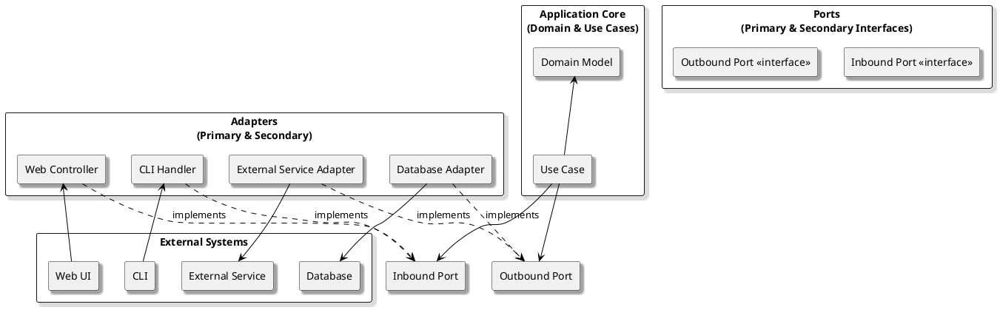

# Hexagonal Architecture (Ports and Adapters)

## Overview

*Hexagonal Architecture*, also known as *Ports and Adapters*, is an architectural style that places the core application logic at the center and connects it to external systems (such as databases, user interfaces, or third-party services) through well-defined interfaces called **ports**. Concrete implementations of these interfaces, called **adapters**, reside at the boundaries. This approach ensures that the core remains isolated, testable, and independent of frameworks and technologies.

### Typical Structure

- **Application Core:** Contains business logic, use cases, and domain rules. It knows nothing about external technologies.
- **Ports:** Interfaces that define how the core interacts with the outside world (e.g., repositories, services, controllers).
- **Adapters:** Implement the ports to connect the application to specific technologies (e.g., database adapters, web controllers, messaging clients).
- **External Systems:** Databases, UIs, APIs, and other infrastructure components.

---

## Strengths and Weaknesses

| Strengths                                         | Weaknesses                                        |
|---------------------------------------------------|---------------------------------------------------|
| Decouples business logic from external systems    | May introduce more interfaces and indirection     |
| Highly testable and easy to mock dependencies     | Can add complexity for simple applications        |
| Facilitates swapping or upgrading technologies    | Requires discipline in maintaining boundaries     |
| Supports multiple input/output mechanisms         | Potential for boilerplate code                    |
| Enables independent evolution of core and adapters| Steeper learning curve for teams new to the style |

---

## When to Use Hexagonal Architecture

**Hexagonal Architecture** is a good fit when:

- You need to isolate business logic from frameworks, databases, or external APIs.
- Your application must support multiple types of interfaces (e.g., web, CLI, messaging).
- Testability and maintainability are high priorities.
- You anticipate frequent changes in infrastructure or external integrations.

**Examples:**

- Applications requiring both REST and message-based interfaces
- Systems that must support multiple databases or third-party services
- Projects where business logic must remain stable as technologies evolve

---

## Practical Tips

- **Define ports in the core:** Keep interfaces that the core depends on within the core layer.
- **Implement adapters at the boundaries:** Place concrete implementations in infrastructure or interface layers.
- **Test the core with mock adapters:** Isolate business logic from external dependencies during testing.
- **Avoid leaking infrastructure concerns into the core:** Maintain strict separation between core and adapters.
- **Document port and adapter responsibilities:** Make boundaries explicit for your team.

---

## Takeaway

Hexagonal Architecture enforces a strong separation between business logic and external systems by using ports and adapters.  
It is ideal for applications that require adaptability, testability, and independence from frameworks or infrastructure, but may introduce extra complexity for simple scenarios.
