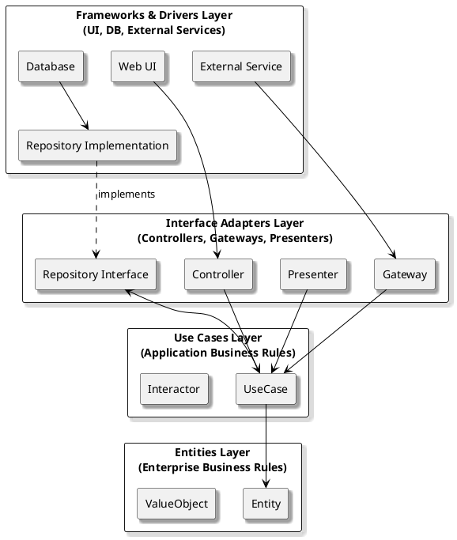

# Clean Architecture

## Overview

*Clean Architecture* is a modern architectural style that organizes software systems into concentric circles, each representing a different level of abstraction. The innermost circles contain business rules and core logic, while the outer circles handle implementation details such as UI, databases, and frameworks. The key principle is that **dependencies always point inward**, ensuring that the core of the system is isolated from external concerns.

### Typical Layers

- **Entities (Enterprise Business Rules):**  
  Core business objects and logic, independent of any application or technology.
- **Use Cases (Application Business Rules):**  
  Application-specific business rules, orchestrating entities to fulfill system requirements.
- **Interface Adapters:**  
  Adapters and gateways that translate data between the core and external systems (e.g., controllers, presenters, repositories).
- **Frameworks & Drivers:**  
  External agents such as UI, databases, web frameworks, and other infrastructure.

---

## Strengths and Weaknesses

| Strengths                                         | Weaknesses                                        |
|---------------------------------------------------|---------------------------------------------------|
| Maximizes independence of business logic          | More upfront design and abstraction required      |
| Highly testable and maintainable                  | Can introduce additional complexity and indirection|
| Adapts easily to technology and infrastructure changes | Steeper learning curve for teams new to the style |
| Supports long-term evolution and refactoring      | Potential for boilerplate code                    |
| Clear separation of concerns and boundaries       | May be overkill for simple or CRUD-centric systems|

---

## When to Use Clean Architecture

**Clean Architecture** is a good fit when:

- Business logic is central, complex, or expected to evolve.
- You require strong isolation from frameworks, databases, or external systems.
- Testability, maintainability, and adaptability are high priorities.
- Your system must support multiple interfaces (web, mobile, APIs) or adapt to changing technologies.

**Examples:**

- Enterprise systems with rich, evolving business rules
- Applications that must survive multiple generations of frameworks or infrastructure
- Systems requiring robust automated testing and long-term maintainability

---

## Practical Tips

- **Keep business rules at the center:** Avoid dependencies from the core to the outer layers.
- **Define interfaces in the core:** Let outer layers provide implementations, injected via dependency inversion.
- **Test the core in isolation:** Use mocks or stubs for infrastructure dependencies.
- **Explicitly document boundaries:** Make dependency direction and layer responsibilities clear for all contributors.
- **Resist shortcutting:** Do not allow UI, database, or framework code to leak into the core.

---

## Takeaway

Clean Architecture enforces a strong separation between business rules and implementation details, ensuring that core logic remains adaptable, testable, and independent of technology choices.  
It is ideal for complex, long-lived systems where business rules must remain insulated from infrastructure changes, but may introduce extra complexity for simple scenarios.
